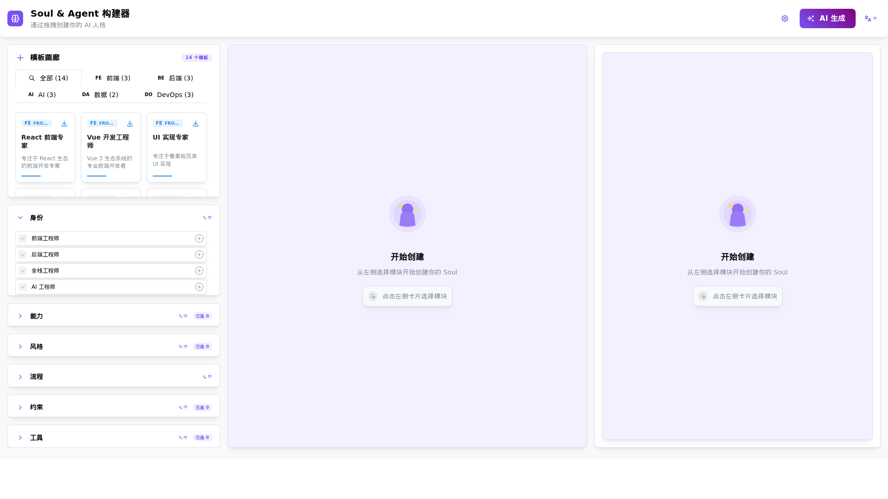
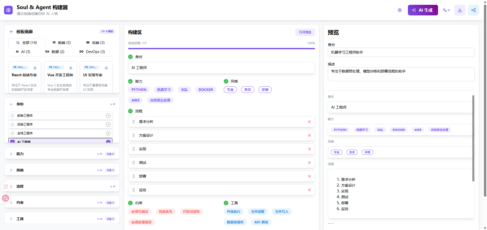

# Soul & Agent Builder

AI Personality Creation Tool — Build high-quality AI Agents/Souls through drag-and-drop modular components

**Live Demo:** https://lgz-star.github.io/soul-agent-builder/

**Other Languages:** [中文](./README.zh.md)



> 💡 Above: Main interface — Left panel shows template gallery and module library, center is the builder zone, right panel displays live preview and export options

---

## AI-Generated Effect Demo



> 💡 Above: AI generation comparison — Left shows the original Soul, right shows the AI-optimized version with enhanced structure and clarity

---

## Features

- **7-Layer Universal Structure** — Identity/Abilities/Style/Flow/Constraints/Knowledge/Tools, covering all Soul elements
- **Drag-and-Drop Assembly** — Build Souls like stacking blocks
- **One-Click Sharing** — Generate unique links to share your creations instantly
- **Multi-Format Export** — Markdown + JSON (OpenClaw + Claude Code supported)
- **AI One-Click Generation** — Describe your needs, AI builds the Soul for you (with progress visualization + cancel anytime)

---

## Quick Start

### Development

```bash
# Clone the repository
git clone https://github.com/YOUR_USERNAME/soul-agent-builder.git
cd soul-agent-builder

# Install dependencies
bun install

# Start development server
bun run dev
```

### Build

```bash
bun run build

# Preview build output
bun run preview
```

### Deploy to GitHub Pages

```bash
bun run deploy
```

---

## AI Feature Configuration (Backend Proxy Required)

### Why a Backend Proxy?

Due to browser **CORS (Cross-Origin Resource Sharing)** restrictions, calling third-party LLM APIs (such as Aliyun, Claude, OpenAI) directly from the browser is blocked.

**Solution:** Run a lightweight backend proxy service to forward all LLM API requests.

### Start the Backend Proxy

```bash
# Start the backend proxy service
bun run server

# Or start both frontend and backend simultaneously
bun run dev:all
```

The backend service runs on `http://localhost:3001` with the following endpoints:
- `GET /health` - Health check
- `POST /api/llm/proxy` - LLM API proxy
- `POST /api/llm/validate` - API validation

### Configure AI Features

1. Open Settings (gear icon in top-right corner)
2. Select a preset service (e.g., "Aliyun Bailian (Coding)")
3. Enter your API Key
4. **Check "Use Backend Proxy"**
5. Click "Validate API Key" to test the connection

### Supported LLM Services

| Preset | Base URL | Recommended Model |
|--------|----------|-------------------|
| Aliyun Bailian (Coding) | `https://coding.dashscope.aliyuncs.com/v1/chat/completions` | `qwen3.5-plus` |
| Aliyun DashScope | `https://dashscope.aliyuncs.com/compatible-mode/v1/chat/completions` | `qwen-plus` |
| Claude | `https://api.anthropic.com/v1/messages` | `claude-sonnet-4-6` |
| OpenAI | `https://api.openai.com/v1/chat/completions` | `gpt-4o` |
| Ollama (Local) | `http://localhost:11434/api/chat` | `llama3` |

### Without Backend Proxy

If you prefer not to run a backend service:
- **Browser Extension:** Install "Allow CORS" or similar extensions to temporarily disable CORS (development only)
- **Local Deployment:** Use local LLM services like Ollama

---

## Tech Stack

| Layer | Technology |
|-------|------------|
| Framework | React 18+ |
| UI Library | Mantine |
| Drag-and-Drop | @dnd-kit |
| State Management | Zustand |
| Build Tool | Vite |
| Testing | Vitest + React Testing Library |
| Backend Proxy | Hono |
| Deployment | GitHub Pages |

---

## Project Structure

```
soul-agent-builder/
├── src/
│   ├── components/
│   │   ├── ModuleLibrary.tsx    # Left module library
│   │   ├── BuilderZone.tsx      # Center builder zone
│   │   ├── PreviewPanel.tsx     # Right preview panel
│   │   ├── SettingsModal.tsx    # API settings modal
│   │   ├── AIGenerateModal.tsx  # AI generation dialog
│   │   └── SoulModule.tsx       # Single module component
│   ├── store/
│   │   ├── soulStore.ts         # Zustand store
│   │   └── soulStore.types.ts   # Type definitions
│   ├── services/
│   │   └── llmService.ts        # LLM API service
│   ├── exporters/
│   │   ├── MarkdownExporter.ts
│   │   ├── JsonExporter.ts
│   │   └── index.ts
│   ├── utils/
│   │   ├── base64.ts            # Base64 utility
│   │   ├── xss.ts               # XSS protection
│   │   └── storage.ts           # localStorage wrapper
│   ├── data/
│   │   ├── identityLibrary.ts   # Identity library
│   │   ├── abilityLibrary.ts    # Ability library
│   │   ├── styleLibrary.ts      # Style library
│   │   ├── flowLibrary.ts       # Flow library
│   │   ├── constraintLibrary.ts # Constraint library
│   │   └── toolLibrary.ts       # Tool library
│   ├── App.tsx
│   └── main.tsx
├── server/
│   └── index.ts                 # Hono backend proxy
├── index.html
├── package.json
├── tsconfig.json
├── vite.config.ts
└── README.md
```

---

## Version Roadmap

### v1.0 MVP (Current)
- [x] Drag-and-drop assembly
- [x] 7-layer structure
- [x] Markdown + JSON export
- [x] localStorage auto-save
- [x] Share link (base64)
- [x] Preset libraries
- [x] Collapsible module library
- [x] Flow drag-and-drop sorting
- [x] Knowledge layer online editing

### v1.0.1.0
- [x] AI generation progress indicator (3-step visualization)
- [x] AI generation cancel function
- [x] LLM service backend proxy (CORS solution)

### v1.1 (Merged into v1.5)
- [x] OpenClaw export → Merged into v1.5
- [x] Claude Code export → Merged into v1.5

### v1.5
- [x] AI One-Click Soul Generation
- [x] Built-in test conversation
- [ ] GitHub repository auto-parsing
- [x] Template gallery

### v2.0
- [ ] User system + cloud storage
- [ ] Soul optimization assistant
- [ ] Soul marketplace (prototype)

---

## Development TODOs

See [TODOS.md](./TODOS.md)

---

## Try It Now

Visit [GitHub Pages Live Demo](https://lgz-star.github.io/soul-agent-builder/) to experience it immediately

---

## License

MIT
